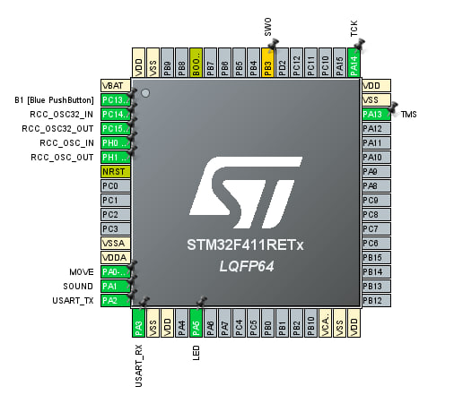
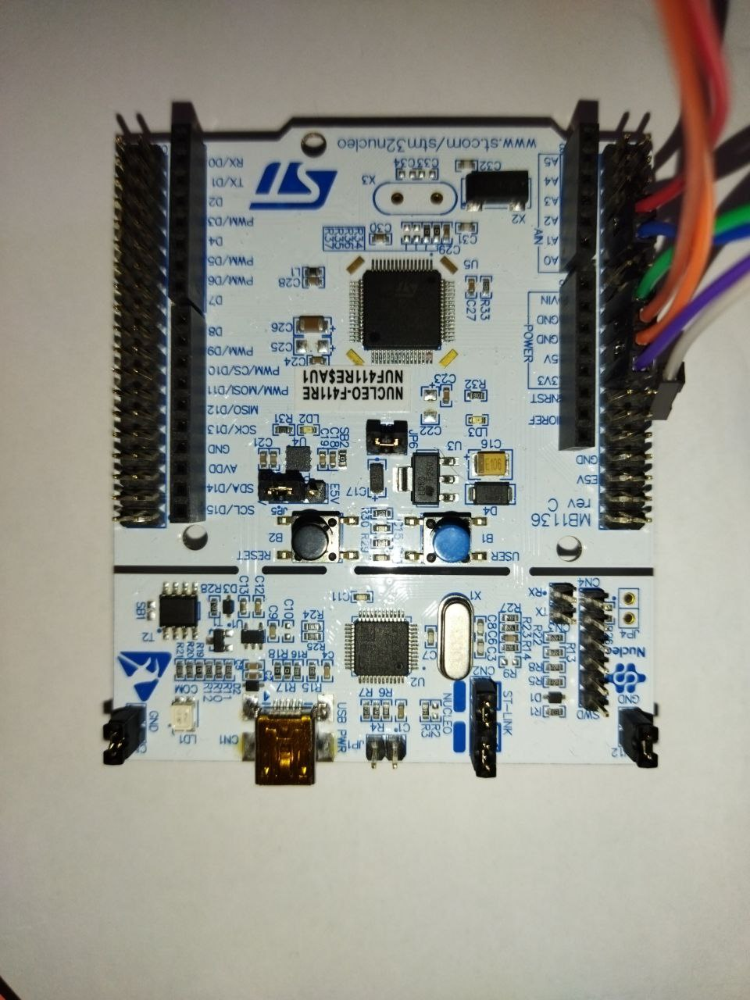
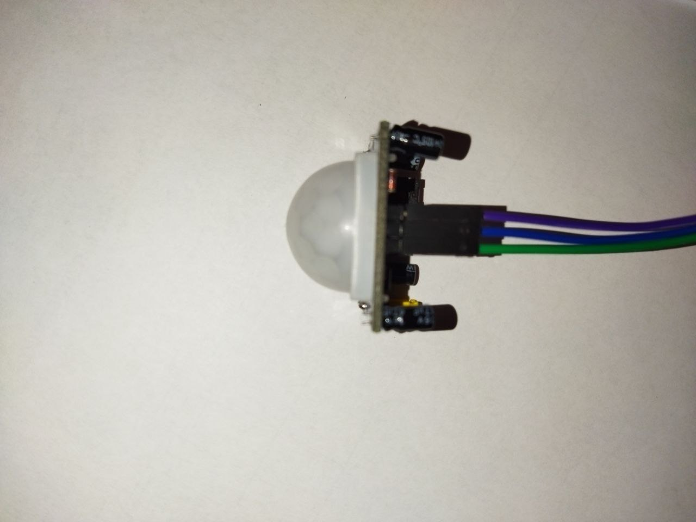
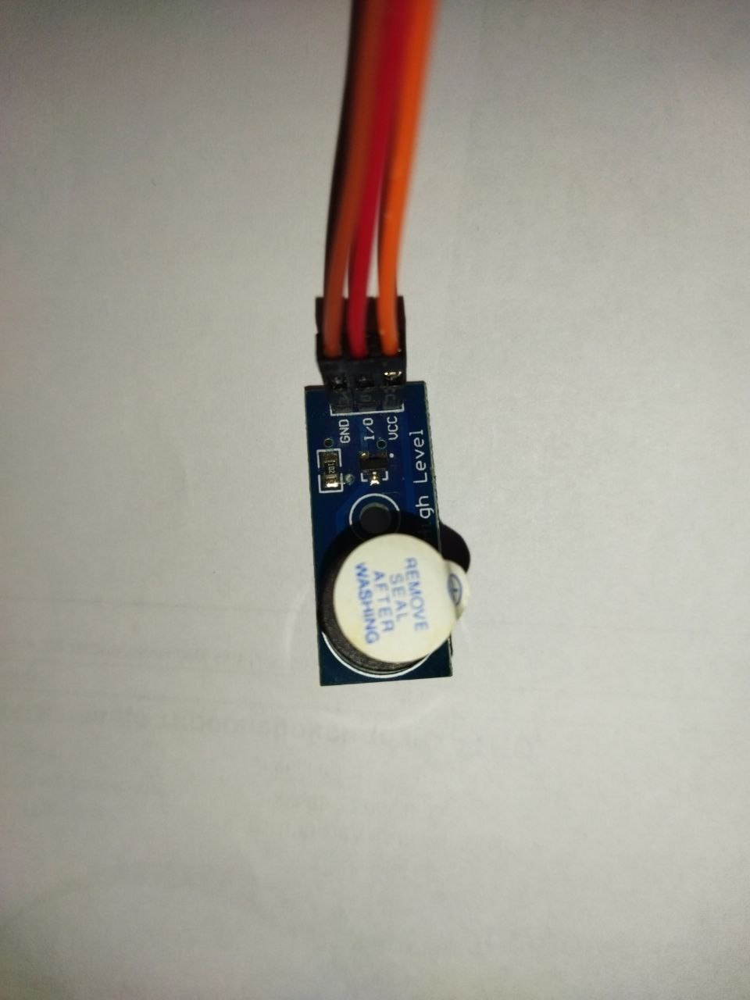

# Motion Detection Alarm System

This is a project for a motion detection alarm system using the **NUCLEO STM32F411RE** microcontroller, an **HC-SR501 PIR motion sensor**, and an **Active Buzzer Module**. The system triggers an audible alarm when motion is detected.

---

## 📜 Table of Contents
- [Introduction](#introduction)
- [Features](#features)
- [Hardware Components](#hardware-components)
- [Circuit Diagram](#circuit-diagram)
- [Software Description](#software-description)
- [Getting Started](#getting-started)
- [How It Works](#how-it-works)
- [Future Improvements](#future-improvements)
- [License](#license)

---

## 📝 Introduction

This project implements a simple motion detection alarm system. It is designed to monitor a specific area and activate an alarm whenever motion is detected. The primary application is in security systems, where it can be used to detect intruders or monitor activity.

---

## 🌟 Features

- **Motion Detection**: Uses the HC-SR501 PIR sensor to detect movement.
- **Audible Alarm**: Activates an active buzzer to signal motion.

---

## 🛠 Hardware Components

- **NUCLEO-F411RE** (microcontroller board)
- **HC-SR501** PIR motion sensor
- **Active Buzzer Module**
- Connecting wires
- Power source (e.g., USB or external battery)

---

## 📟 Circuit Diagram

Here is a brief description of the connections:
1. **HC-SR501 PIR Sensor**:
   - `VCC`: 5V (from STM32 board)
   - `GND`: Ground
   - `OUT`: Connected to a GPIO pin (e.g., PA0)

2. **Active Buzzer Module**:
   - `VCC`: 5V (from STM32 board)
   - `GND`: Ground
   - `IN`: Connected to a GPIO pin (e.g., PA1)

---

## 💻 Software Description

The system uses **STM32 HAL drivers** and is developed using **STM32CubeIDE**. The core functionality includes:
1. Configuring GPIO pins for the PIR sensor and buzzer.
2. Detecting the HIGH signal from the HC-SR501 sensor.
3. Triggering the buzzer for a specific duration when motion is detected.

### Dependencies:
- STM32 HAL library
- STM32CubeIDE version 1.17.0 or later

---

 ## Developers
 
[y.kovalchuk](https://github.com/job-space)

## License

Project NUCLEO-ALARM is distributed under the MIT lisense.

## 🚀 Getting Started

### 1. Clone the repository:
```bash
git clone https://github.com/job-space/NUCLEO-ALARM.git
cd NUCLEO-ALARM
